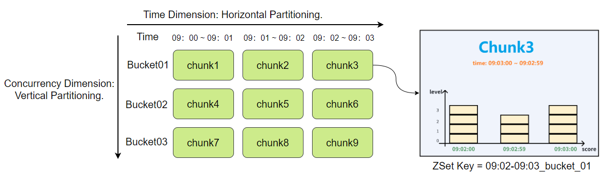
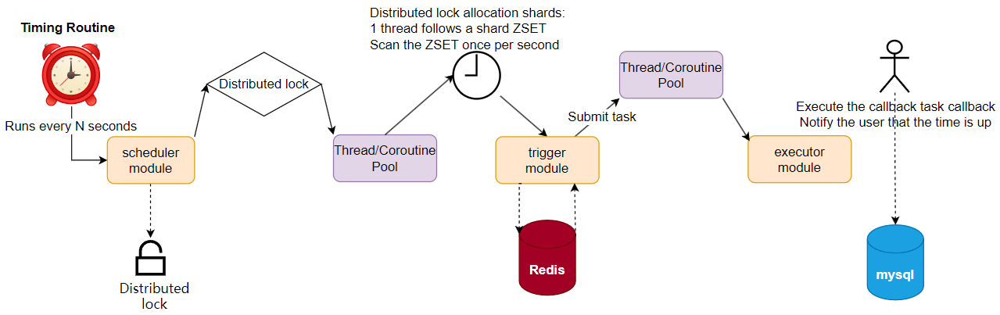
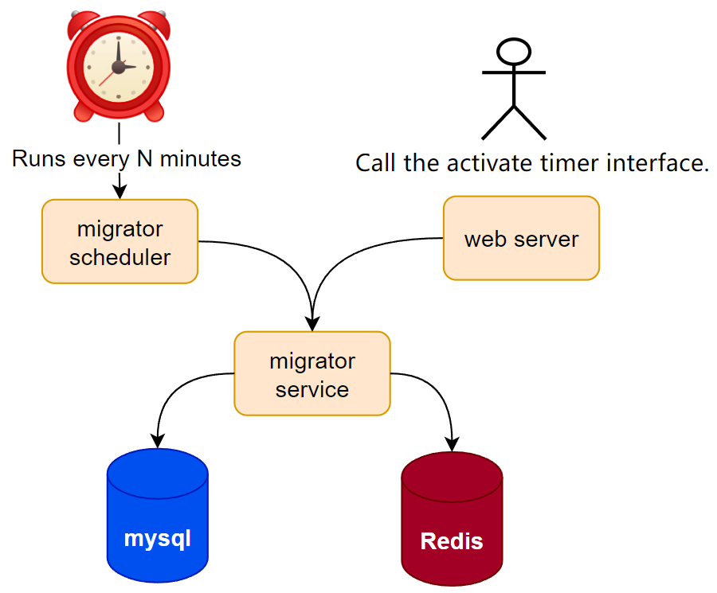
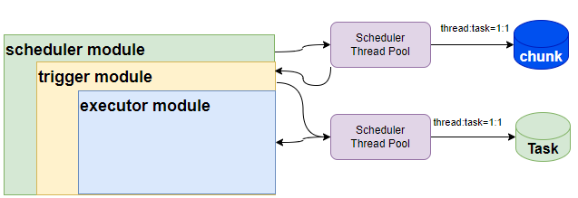

# HTimer
Honor has a large number of scheduled and periodic tasks that need to be processed on time. Htimer is a microservice system developed in Java, designed to function as an alarm clock service within the microservices architecture. It supports high precision and high load scheduling requirements.

## Overall design

- **Microservice Design:** Utilized common Go microservice technologies such as the Kratos framework and Gin framework.
- **Storage Design:** Effectively addressed issues of high precision and high load through a dual storage architecture using MySQL and Redis, along with data sharding, data ordering, and hot-cold data partitioning.
- **Implementation:** Introduced modular and asynchronous design approaches to ensure clear code structure and module responsibilities, significantly enhancing scalability and maintainability.
- **Performance Optimization:** Conducted stress testing to identify and resolve performance bottlenecks, increasing performance from 1400 QPS to 4000 QPS, nearly a threefold improvement.

## Challenges/Highlights

- **High Precision:** Achieved by designing a divide-and-conquer approach for data, ensuring orderliness and a dual storage structure for high-frequency scanning. Combined with Go coroutine pools and connection pools, the precision error of scheduled tasks was effectively controlled to within one second.
- **High Load:** Addressed long processing times for large batches of tasks triggered simultaneously by using Redis ZSET for data sharding across different cluster nodes, providing a foundation for concurrent task processing. Combined with Go coroutine pools and connection pools, tasks are processed quickly even under high load.
- **Hot-Cold Data Partitioning:** Efficient coordination of resource usage between hot and cold data is critical. Htimer's migrator module design ensures that dynamic hot data is maintained in cache for efficient storage, while cold data is stored on disk or generated on demand, reducing the occupation of critical memory resources in the cache.

## Storage structure

 

## Dispatch Process

  

## Creation Process

  

## Modular Design

 